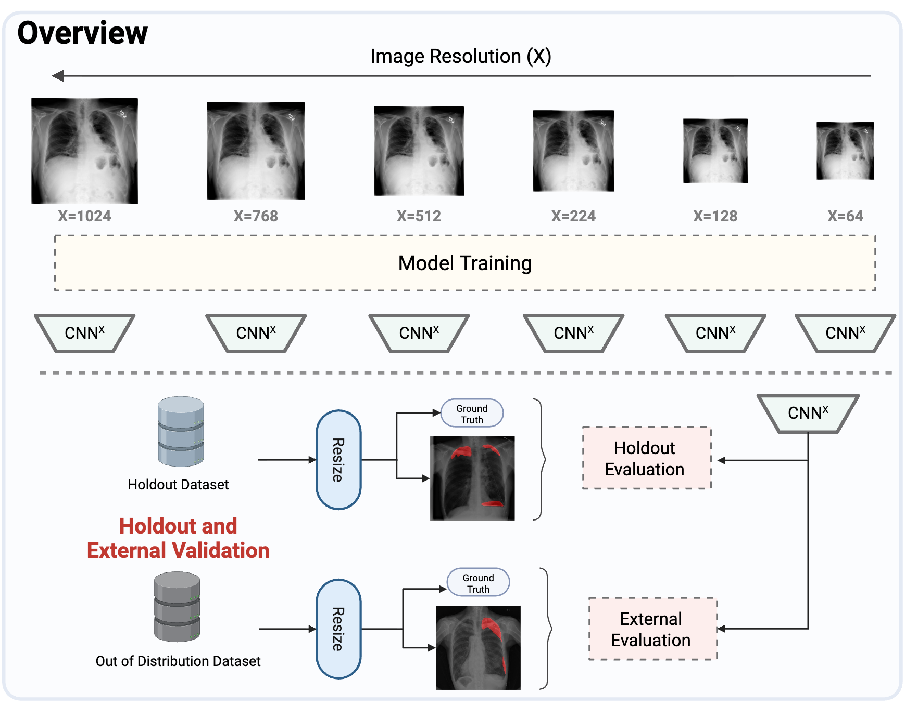

# Sharpness Matters: Rethinking the Impact of Image Resolution on Medical Image Classification

[](https://www.python.org/downloads/)
[](https://opensource.org/licenses/MIT)
[](https://github.com/psf/black)

## Table of Contents
- [Overview](#overview)
- [Installation](#installation)
- [Datasets Used](#datasets-used)
- [Prepare Config File](#prepare-config-file)
- [Usage](#usage)
- [Contributing](#contributing)
- [Citation](#citation)
- [License](#license)
- [Contact](#contact)
- [Acknowledgments](#acknowledgments)

## Overview

This repository contains the official implementation of our paper **"Sharpness Matters: Rethinking the Impact of Image Resolution on Medical Image Classification"**.

Training deep learning chest radiograph classifiers at higher resolutions resulted in better performance generalizability to external test sets and more precise explanations, highlighting the importance of training data image resolution for clinical AI systems.

<!-- Pipeline overview with enforced white background -->
<div style="background:#ffffff;padding:8px;border:1px solid #ddd;display:inline-block;">
    
</div>

## Installation

### Prerequisites
-  Python 3.8.10
- CUDA-compatible GPU (recommended)

### Quick Start

1. **Clone the repository**
    ```bash
    git clone https://github.com/your-username/sharpness_matters.git
    cd sharpness_matters
    ```

2. **Create conda environment and install**
    ```bash
    conda create -n sharpness_matters python=3.8.10
    conda activate sharpness_matters
    pip install -e .
    
    # For development (optional)
    pip install -e .[dev]
    ```

## Datasets Used

This project uses five public datasets:

### SIIM-ACR Pneumothorax Challenge Dataset
- **Source**: [Kaggle Competition](https://www.kaggle.com/c/siim-acr-pneumothorax-segmentation)
- **Images**: ~12,000 chest X-rays
- **Format**: DICOM files

### RSNA Pneumonia Detection Challenge Dataset  
- **Source**: [Kaggle Competition](https://www.kaggle.com/c/rsna-pneumonia-detection-challenge)
- **Images**: ~26,000 chest X-rays  
- **Format**: DICOM files

### SIIM-FISABIO-RSNA COVID-19 Detection Dataset
- **Source**: [Kaggle Competition](https://www.kaggle.com/c/siim-covid19-detection)
- **Images**: ~6,400 chest CT/X-ray studies
- **Format**: DICOM files

### VinBigData Chest X-ray Abnormalities Detection Dataset
- **Source**: [Kaggle Competition](https://www.kaggle.com/c/vinbigdata-chest-xray-abnormalities-detection)
- **Images**: ~18,000 chest X-rays
- **Format**: DICOM files

### PTX498 Dataset
- **Source**: [DeepSDM](https://github.com/wangyunpengbio/DeepSDM)
- **Images**: 498 chest X-rays with expert annotations
- **Format**: NIFTI files

## Prepare Config File

1. **Download datasets** from their respective sources (Kaggle competitions, etc.)

2. **Update configuration**: Edit the dataset paths and checkpoint settings in `sharpness_matters/config/config.yaml`:
    ```yaml
    # Dataset paths - Update all paths below to match your local dataset directories
        ptx:
          siim_acr:
            root_dir: "/path/to/your/datasets"
            vindr:
                root_dir: "/path/to/your/datasets"
            ptx498:
                root_dir: "/path/to/your/datasets"
        pneumonia:
          rsna_pneumonia:
            root_dir: "/path/to/your/datasets"
            siim_covid:
                root_dir: "/path/to/your/datasets"
    
    # Model checkpoint settings
    model:
        checkpoint_dir: "/path/to/your/checkpoints"  # Where to save model checkpoints
        tuned_checkpoint_dir: "/path/to/your/checkpoints"  # Optional, you only need this if you want to compare cross validation with standard parameters vs tuned parameters
    ```

## Usage

Before running any commands, navigate to the appropriate task directory:

```bash
# For pneumothorax experiments
cd sharpness_matters/ptx

# For pneumonia experiments  
cd sharpness_matters/pneumonia
```

### Basic Training

**Train pneumothorax classifier:**
```bash
python train/train_kfold.py --model_name densenet
```

**Train pneumonia classifier:**
```bash
python train/train_kfold.py --model_name resnet
```

### Hyperparameter Optimization (Optional Ablation)

```bash
python train/train_sweep.py
```

### Evaluation

**Classification performance:**
```bash
python evaluation/evaluate_kfold.py --validation_mode holdout

python evaluation/evaluate_kfold.py --validation_mode ood
```

**Saliency map evaluation:**
```bash
# Internal test set
python evaluation/evaluate_saliency.py

# External test set
python evaluation/evaluate_saliency_ood.py
```

### Statistical Analysis

```bash
# Classification performance significance testing
python evaluation/p_value_classification.py --dataset holdout --model_name densenet

# Saliency map quality significance testing  
python evaluation/p_value_saliency.py --dataset external --model_name resnet
```

### Performance Benchmarking

```bash
python evaluation/computational_usage.py --model_name densenet
```

## Citation

If you use this code in your research, please cite our paper:

```bibtex
@article{kulkarni2024sharpness,
  title={Sharpness Matters: Rethinking the Impact of Image Resolution on Medical Image Classification},
  author={Kulkarni, Aditya and Zech, John and Yi, Paul},
  journal={Journal Name},
  year={2025},
  volume={XX},
  pages={XX-XX}
}
```

## Contact

- **Repository Issues**: Please use [GitHub Issues](https://github.com/your-username/sharpness_matters/issues) for bug reports and feature requests
- **General Questions**: Open a [Discussion](https://github.com/your-username/sharpness_matters/discussions)
- **Paper Authors**: Aditya Kulkarni, John Zech, Paul Yi

## Acknowledgments

- St. Jude Children's Research Hospital for computational resources